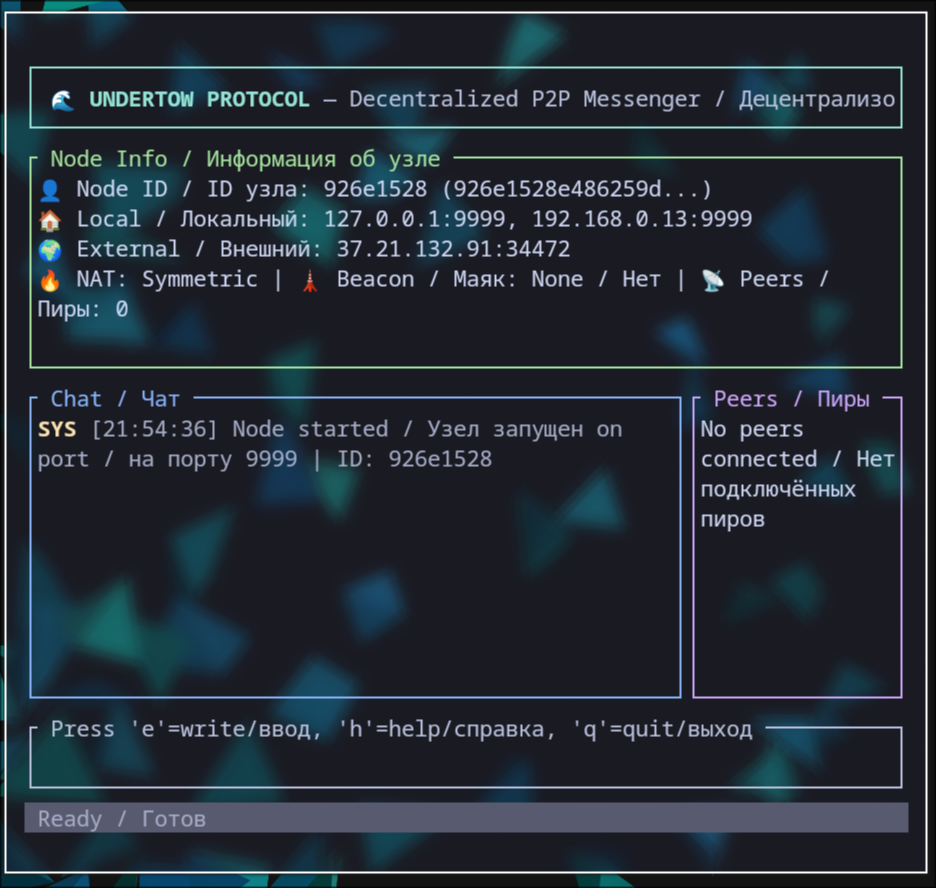

<div align="center">

# 💬 Undertow Client

*Референсная TUI-реализация протокола Undertow.*

[](https://www.rust-lang.org)
[](../LICENSE)
[](https://github.com/daniil-verba/undertow-client)

**Текущая версия: v0.1.0** | [Список изменений](CHANGELOG.ru.md)

**Русский** | [English](README.md)

</div>

---

> Терминальный мессенджер, демонстрирующий протокол Undertow в действии. Создан для разработчиков и энтузиастов, которые хотят увидеть, как работает протокол — и реально пообщаться через него.

## Что такое Undertow Client

**Undertow Client** — это референсная реализация TUI (Terminal User Interface) поверх библиотеки [undertow-protocol](https://github.com/daniil-verba/undertow-protocol). Это **не** мессенджер для массового пользователя — это инструмент разработчика, полигон для тестов и живой пример интеграции протокола в приложение.

Думай о нём как о **DEBUG UI** с реальным сетевым стеком: генерируешь PeerId, подключаешься к маяку, добавляешь пиров по их PeerId и обмениваешься сообщениями — всё из терминала.

> ⚠️ **Это инструмент для тестирования, не продукт.** Он намеренно минималистичен. Если ты ищешь полноценный мессенджер — это не он. Пока что.

## Для кого это

| Аудитория | Зачем использовать |
|-----------|-------------------|
| **Разработчики** | Посмотреть, как работает `undertow-protocol` на практике |
| **Контрибьюторы протокола** | Тестировать изменения сетевого слоя |
| **Энтузиасты** | Общаться через кастомный P2P-протокол из терминала |
| **Пользователи Termux** | Запускать на Android для тестов в поле |

> 🐧 **Только Linux** (включая Termux на Android). Сборок под Windows и macOS нет.

## Как это выглядит

```
┌─────────────────────────────────────────────────────────────┐
│  Undertow Client v0.1.0           │  Пиры                   │
│                                   │  ─────────────────────  │
│  [14:32:01] Alice: Привет!        │  Alice                  │
│  [14:32:15] Вы: Привет, тестирую  │  Bob                    │
│  [14:33:02] Alice: Работает!      │  Charlie                │
│                                   │                         │
│  > _                              │  Маяк: 1.2.3.4:7777     │
│                                   │                         │
└─────────────────────────────────────────────────────────────┘
```



## Возможности

| Функция | Статус | Примечания |
|---------|--------|-----------|
| P2P-переписка | ✅ Работает | Личные чаты через релей |
| Генерация PeerId | ✅ Работает | Автоматически при первом запуске |
| TUI-интерфейс | ✅ Работает | ratatui: чат + список пиров + инфо о маяке |
| Добавление пиров по PeerId | ✅ Работает | Ручной ввод |
| Подключение к маяку | ✅ Работает | Обязательно для работы |
| LAN-режим | 📋 В планах | Прямое обнаружение в локалке |
| История сообщений | 📋 В планах | Пока только в памяти |
| E2E-шифрование | 📋 В планах | Пока не реализовано |
| Групповые чаты | ❌ Вряд ли | Вне скоупа дебаг-инструмента |
| Уведомления | ❌ Нет | Не планируются — это тестовый клиент |

## Быстрый старт

### Требования

- **Rust** 1.70+ (`rustc --version`)
- **Linux** или **Termux на Android**
- Запущенный сервер [Beacon](https://github.com/daniil-verba/undertow-beacon) с известным IP:порт

### Запуск

```bash
# Клонируй репозиторий
git clone https://github.com/daniil-verba/undertow-client.git
cd undertow-client

# Запусти клиент
cargo run
```

При первом запуске клиент генерирует твой `PeerId` и запрашивает:

1. **Адрес маяка** — IP:порт запущенного Beacon (например, `1.2.3.4:7777`)
2. **Пир для чата** — введи `PeerId` другого пользователя

Готово. Печатай сообщения и жми Enter для отправки.

> 🔌 **Маяк обязателен.** Клиент не работает без доступного сервера Beacon.

## Как это работает

```
┌─────────────┐         ┌─────────────┐         ┌─────────────┐
│   Ты        │◄───────►│   Маяк      │◄───────►│   Пир       │
│ (Клиент)    │  релей  │  (VPS)      │  релей  │ (Клиент)    │
└─────────────┘         └─────────────┘         └─────────────┘
```

1. Ты вводишь адрес маяка — клиент подключается и регистрирует твой PeerId
2. Ты вводишь PeerId пира — клиент запрашивает у маяка его endpoint
3. Если прямое соединение не удалось (а за NAT оно обычно не удалось), трафик релеится через маяк
4. Сообщения обмениваются в реальном времени

### NAT и Hole Punching

Сейчас клиент полагается на **релей-режим** для большинства соединений. Hole punching реализован заглушками — на практике симметричный NAT делает его почти невозможным на большинстве домашних сетей. LAN-режим запланирован как более надёжная локальная альтернатива.

## Архитектура

```
┌─────────────────────────────────────────────┐
│           Undertow Client (TUI)              │
│  ┌─────────┐  ┌─────────┐  ┌─────────────┐ │
│  │   Чат   │  │  Пиры   │  │ Инфо о маяке│ │
│  │  Вид    │  │  Список │  │             │ │
│  └────┬────┘  └────┬────┘  └──────┬──────┘ │
│       └─────────────┴──────────────┘        │
│                   │                          │
│         ┌────────┴────────┐                 │
│         │  undertow-protocol│                 │
│         │  (Сеть, DHT,    │                 │
│         │   Крипта и т.д.) │                 │
│         └────────┬────────┘                 │
│                  │                           │
│         ┌────────┴────────┐                 │
│         │   Сервер Beacon  │                 │
│         │  (рандеву +      │                 │
│         │   ретрансляция)  │                 │
│         └─────────────────┘                 │
└─────────────────────────────────────────────┘
```

## Концепция "Один аккаунт — все приложения"

Хотя этот клиент — всего лишь тестовый стенд, лежащий в основе протокол открывает мощную идею: **один PeerId для всего**.

```
┌─────────────┐     ┌─────────────┐     ┌─────────────┐
│   Игра A    │◄───►│  UTW Client │◄───►│  Telegram   │
│  (wrapper)  │     │  (этот TUI) │     │    Бот      │
└──────┬──────┘     └──────┬──────┘     └──────┬──────┘
       │                   │                   │
       └───────────────────┼───────────────────┘
                           │
                    ┌──────┴──────┐
                    │  UTW Account  │
                    │   "Alice"     │
                    │  PeerId + key │
                    └─────────────┘
```

Твой PeerId и ключи переносимы между любыми приложениями на базе `undertow-protocol`. Этот клиент демонстрирует чат-слой — игры, боты и другие приложения используют ту же личность.

> Эта интеграция живёт на уровне протокола, а не в этом клиенте. Клиент — лишь один из возможных фронтендов.

## Экосистема

| Репозиторий | Назначение | Статус |
|-------------|-----------|--------|
| [undertow-protocol](https://github.com/daniil-verba/undertow-protocol) | Ядро (PeerId, крипта, сеть) | 🚧 Прототип |
| **undertow-client** | TUI тест-клиент / референсная реализация | 🚧 Прототип |
| [undertow-beacon](https://github.com/daniil-verba/undertow-beacon) | Сервер ретрансляции и рандеву | 🚧 Прототип |
| [undertow-harbor](https://github.com/daniil-verba/undertow-harbor) *(планируется)* | Доверенный bootstrap-узел | 📋 В планах |

## Дорожная карта

- [x] Базовый TUI (чат + пиры + инфо о маяке)
- [x] Автогенерация PeerId
- [x] Ручное добавление пиров по PeerId
- [x] Переписка через релей
- [ ] LAN-режим (прямое локальное обнаружение)
- [ ] Персистентность сообщений (локальное хранилище)
- [ ] E2E-шифрование (X25519 + AEAD)
- [ ] Автообнаружение маяка (без ручного ввода IP)
- [ ] Просмотр статических веб-страниц (WASM/браузерный эксперимент)

## Участие в разработке

Этот клиент в первую очередь — **инструмент для тестирования**. Хотя вклад приветствуется, проекту больше всего нужна помощь в:

1. **[undertow-protocol](https://github.com/daniil-verba/undertow-protocol)** — ядро библиотеки (сеть, крипта, DHT)
2. **Своём приложении** — форкни этот клиент или начни с нуля, используя `undertow-protocol` как зависимость

Если хочешь добавить тестовую фичу в клиент (новый виджет TUI, демо фичи протокола и т.д.) — открывай PR. Но для серьёзной разработки мы рекомендуем строить поверх протокола, а не расширять этот дебаг-UI.

> 🧪 **Тестов пока нет.** Проект слишком ранний для тестового набора. Если знаешь Rust-тестирование и хочешь помочь — начни с crate протокола.

## Известные ограничения

| Ограничение | Почему | Будущее |
|-------------|--------|---------|
| Нет истории сообщений | Только в памяти | Локальное хранилище в планах |
| Нет шифрования | Пока не реализовано | X25519 + AEAD в планах |
| Ручной IP маяка | Пока нет механизма обнаружения | Harbor bootstrap в планах |
| Только Linux / Termux | Зависимости TUI | GUI планируется в отдельном репо |
| Нет конфиг-файла | Хардкод | Система конфигурации в планах |
| Нет офлайн-сообщений | Не реализовано | Буферизация на маяке в планах |

## Требования

- **Rust** — последний stable
- **ОС** — Linux (десктоп или Termux на Android)
- **Сеть** — Интернет + доступный сервер Beacon

---

## 🤝 Присоединяйся к разработке

Undertow Client — это открытый проект, и мы рады любым вкладам: от исправления опечаток до добавления новых функций.

**Ты можешь помочь, даже если никогда не писал на Rust:**

- 🐛 **Сообщить о баге** — [Создать Issue](https://github.com/daniil-verba/undertow-client/issues)
- 💡 **Предложить идею** — [Начать обсуждение](https://github.com/daniil-verba/undertow-client/discussions)
- 📚 **Улучшить документацию** — Мы ценим любые правки в README и комментариях
- 💻 **Написать код** — Посмотри [Good First Issues](https://github.com/daniil-verba/undertow-client/issues?q=is%3Aissue+is%3Aopen+label%3A%22good+first+issue%22)
- 🌍 **Перевести** — Помоги с переводом на другие языки

---

### 📖 С чего начать

1. **Прочитай** [CONTRIBUTING.md](CONTRIBUTING.md) — там описаны правила работы с кодом.
2. **Ознакомься** с [CODE_OF_CONDUCT.md](CODE_OF_CONDUCT.md) — мы ценим уважение и открытость.
3. **Выбери задачу** из списка [Good First Issues](https://github.com/daniil-verba/undertow-client/issues?q=is%3Aissue+is%3Aopen+label%3A%22good+first+issue%22).
4. **Присоединяйся к обсуждениям** в [Discord](https://discord.gg/rqJJf9WcV6) — там всегда помогут с первым шагом.

> 👋 **Я — основатель проекта.** Я лично ревьюю каждый PR и помогаю новичкам влиться в процесс. Не бойся ошибаться — мы всё поправим вместе.

---

## Лицензия

[MIT](LICENSE) — свободно использовать, модифицировать и распространять. Коммерческое использование разрешено.

## Контакты

- 📧 [daniilverba123@gmail.com](mailto:daniilverba123@gmail.com)
- 💬 [Discord](https://discord.gg/rqJJf9WcV6)
- 🐛 Issues — [GitHub Issues](https://github.com/daniil-verba/undertow-client/issues)

---

<div align="center">

*Окно в Undertow. Создано для тех, кто строит.*

</div>
